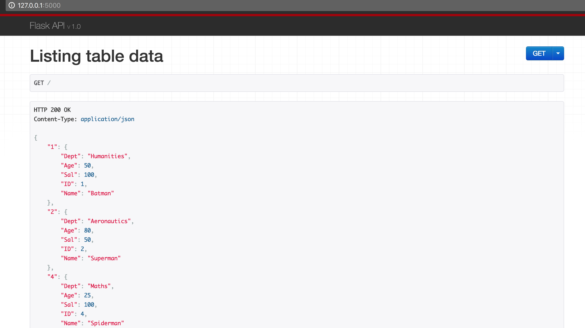
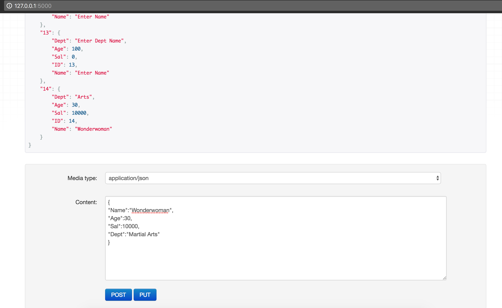
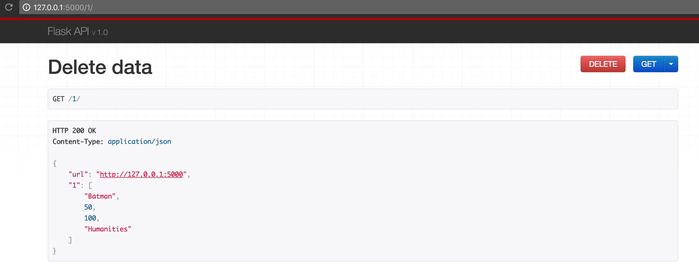

REST-API-CRUD-Ops
---------------------

RESTful API build in Flask and MySQL that interacts with the Database to perform CRUD operations

Display Table Data:
--------------------
The API contains a GET request which inturn triggers a SELECT statement which fetches data from the Database real-time and displays them.

Create and Update Data:
-----------------------
POST and PUT requests respectively perform Create and Update operations

Delete data
------------------------
A single table row can be chosen by providing the row ID in the URL as <URL>/<RowID>. The selected row is displayed along with the option to Delete the same.

Dump: emp_tbl_dump.sql